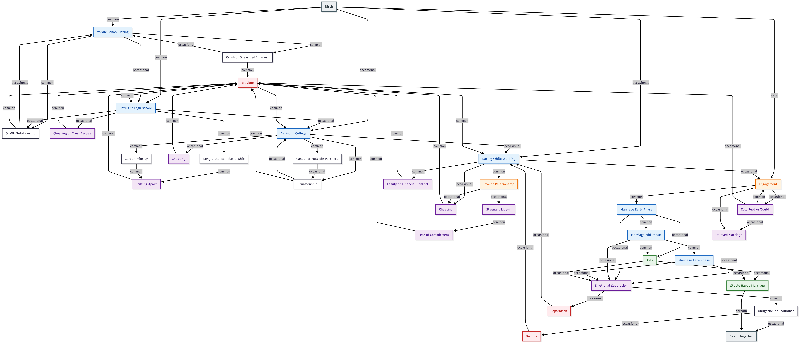

# relationshiplifecycle
# A Lifecycle Model of Modern Relationships

This repository contains a Mermaid-based flowchart modeling the lifecycle of modern romantic relationships.

The model represents:
- Multiple entry points into dating and commitment
- Non-linear progression with loops, delays, and re-entries
- Realistic transitions including uncertainty, obligation, separation, and endurance
- A single biological terminal state (death)

The diagram is descriptive, not prescriptive.  
It is intended for conceptual, academic, and analytical use.

## Diagram

The core model is defined in:
- `diagram/lifecycle.mmd`

Rendered versions are available in:
- `exports/lifecycle.svg`
- `exports/lifecycle.png`

## Tools Used
- Mermaid.js

## License
MIT
